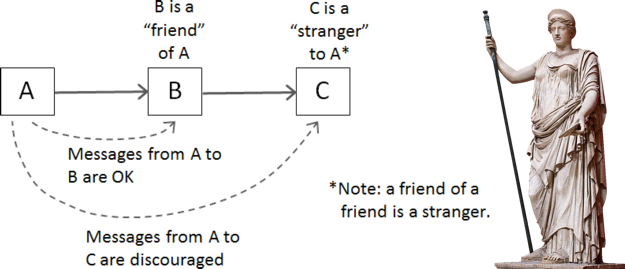

###### created by [osman-boy](https://github.com/osman-boy)

#LoD(Law of Demeter, LoD. Закон Деметры)
Или принцип наименьшего знания. Этот принцип гласит: Каждый элемент системы
должен иметь ограниченные знания о других элементах. То есть,
"каждый элемент должен разговаривать только со своими друзьями" и "не разговаривать с незнакомцами"



Метод объекта может вызывать только методы:
* Самого объекта.
* Аргумент метода.
* Любого объекта, созданного в рамках метода.
* Любых прямых свойств/полей объекта.

Расмотрим случай: Смоделируем деловые отношения между разносчиком газет и покупателем газет.
Разносчик звонит в дверной звонок, покупатель открывает дверь, разнозчик должен получить оплату и
передать газету покупателю.

```kotlin
// Покупатель
class Customer(firstName: String , lastName: String) {
    // кошелек
    val wallet = Wallet(1_000)
}

// класс Кошелек
class Wallet(var moneyAmount: Int) {

    fun withDrawMoney(amount: Int) {
        moneyAmount -= amount
    }
}

// Разносчик газет
class PaperBoy {

    fun deliverMagazine(costOfMagazine: Int , customer: Customer) {
        // Разносчик бумаг берет бумажник покупателя и проверяет,
        // если денег достаточно, то он берёт нужную сумму.
        val wallet = customer.wallet
        if (wallet.moneyAmount >= costOfMagazine) {
            wallet.withDrawMoney(costOfMagazine)
        } else {
            // в противном случае, разносчик уходит.
        }
    }
}
```

Вроде бы все круто, и программа вообще-то работает корректно. Но что-то здесь не так!
Что? Если всгялнуть на это немного глубже, то можно заметить что есть нечто странное в том факте что
разносчик газет, берет бумажник клиента, что бы получить деньги. У продавца газет есть доступ к
бумажнику покупателья! Тут Закон Деметры очиведен.

**Нарушения:**

* Разносчик газет берет бумажник клиента.
* Разносчик проверяет количестов денег в кошелке.
* Разносчик берет из бумажника деньги. Говоря осмысленно, разнозчик газет получает больше
  информации, чем ему необходимо. Все проблемы являютс следствием этого факта. И кроме, все классы
  очень тесно связаны. Если мы изменим класс Wallet, нам возможно придется внести изменения и в
  другие два класса.

Решение проблемы:

```kotlin

// Покупатель
class Customer(firstName: String , lastName: String) {
    // кошелек
    private val wallet = Wallet(1_000)

    fun getPayment(amount: Int): Int {
        if (wallet.moneyAmount > amount) {
            wallet.withDrawMoney(amount)
            return amount
        } else {
            return 0
        }
    }
}

// класс Кошелек
class Wallet(var moneyAmount: Int) {

    fun withDrawMoney(amount: Int) {
        moneyAmount -= amount
    }
}

// Разносчик газет
class PaperBoy {

    fun deliverMagazine(costOfMagazine: Int , customer: Customer) {
        customer.getPayment(costOfMagazine)
    }
}
```

И так, теперь исправленный стал лучше по 3 параметрам:

* Он лучше моделирует реальность сценарии. Код класса **PaperBoy** теперь просить у клиента
  оплату. Разносчик газет не имеет доступа к кошелку.
* Теперь класс **Wallet** может быть изменен, а разносчик газет полностью изолирован от этих изменений.
* Теперь мы спокойно можем изменить реализацию **getPayment**
