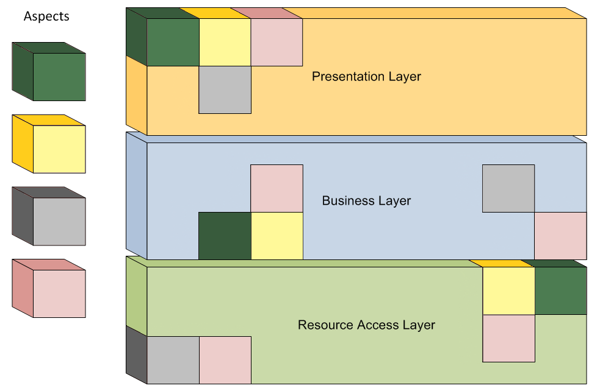

###### created by [osman-boy](https://github.com/osman-boy)

# **SoC(Separation of Concerns)**

Программа, которая хорошо воплощает SoC, называется модульной программой. Модульность и,
следовательно, разделение задач достигаются путем инкапсуляции информации внутри раздела кода,
который имеет четко определенный интерфейс.

###### - источник: википедия

Разделение задач (SOC) является одним из основных принципов проектирования программного обеспечения,
который широко соблюдается. Основная идея этого принципа заключается в выделении программного
приложения в отдельные разделы. В каждом разделе следует рассмотреть конкретную проблему, которая
мало пересекается с другими разделами.


Коротко о SoP:

* [SRP](https://github.com/osman-boy/Learn-CleanArchitecture-DesignPatterns-SolidPrinciples/blob/33b3aa587531f1d2df69771cd37bdfaaa0152b28/src/main/kotlin/solid/srp/SRP.md)
  и SoC тесно связаны.
* SoC подрозумевает разделение ответственносей на разные модули.
* Позволяет строить модульные системы.


**Слоистые ответственности:**
* UI
* Business Logic
* Presentation Logic


[//]: # (Расмотрим нарушение этого принципа:)

[//]: # (Слой презентаций "знает" о UI:)

[//]: # (```kotlin)

[//]: # (class )

[//]: # (```)
