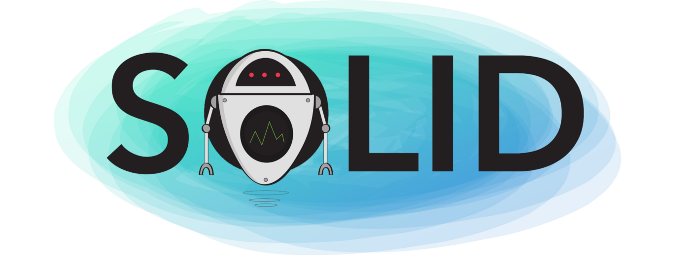

######created by [osman-boy](https://github.com/osman-boy)
# **SOLID**
**SOLID** — это аббревиатура от первых пяти принципов объектно-ориентированного проектирования (OOD) Роберта С.
Мартина (также известного как дядя Боб). более понятными, гибкими и поддерживаемыми.

Что на самом деле означают принципы
SOLID? Ну, это просто аббревиатура из пяти принципов, перечисленных ниже.
**S** - _Единый принцип ответственности (известный как SRP)_
**O** - _Открытый/Закрытый принцип_
**L** - _Принцип замены Лиськова_
**I** - _Принцип сегрегации интерфейса_
**D** - _Принцип инверсии зависимостей_

