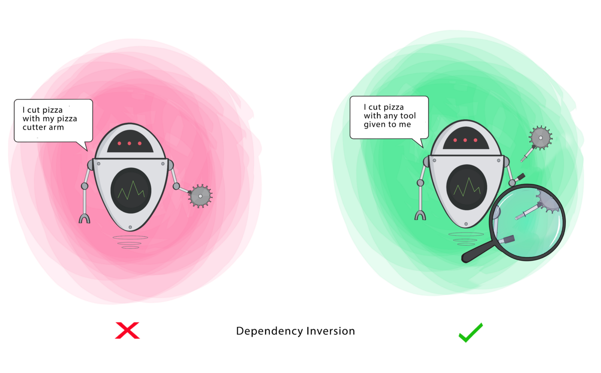

###### created by [osman-boy](https://github.com/osman-boy)

# **DIP(Dependency Inversion Principle)**

Принцип инверсии зависимостей. Этот принцип гласит, классы верхних уровней не должны зависеть от классов нижних уровней.
Оба должны зависеть от абстракций. Абстракции не должны зависеть от деталей. Детали должны зависеть от абстракций.

Обычно при проектировании программ можно выделить два уровня классов:

* Классы нижнего уровня реализуют базовые операции вроде работы с диском, передачи данных по сети, подключения к базе
  данных и прочее.
* Классы высокого уровня содержат сложную бизнес-логику программы, которая опирается на классы низкого уровня для
  осуществления более простых операций.

Что бы следовать этому принципу:

* Для начала вам нужно описать интерфейс низкоуровневых операций, которые нужны классу бизнес-логики.
* Это позволит вам убрать зависимость класса бизнес-логики от конкретного низкоуровневого класса, заменив её «мягкой»
  зависимостью от интерфейса.
* Низкоуровневый класс, в свою очередь, станет зависимым от интерфейса, определённого бизнес-логикой. Принцип инверсии
  зависимостей часто идёт в ногу с принципом открытости/закрытости..




Предположим, что нам нужно разработать мобильное приложение как для Android, так и для iOS. Для этого нам нужен
разработчик Android и разработчик iOS. Эти классы будут иметь метод разработки мобильного приложения с использованием
собственной платформы и языка программирования:

```kotlin
class AndroidDeveloper {
    fun developMobileApp() {
        println("Developing Android Application by using Kotlin")
    }
}

class IosDeveloper {
    fun developMobileApp() {
        println("Developing iOS Application by using Swift")
    }
}

fun main() {
    val androidDeveloper = AndroidDeveloper()
    val iosDeveloper = IosDeveloper()

    androidDeveloper.developMobileApp()
    iosDeveloper.developMobileApp()

}
```

Мы зависимы от конкретной реализации. Чтобы исправить проблему здесь, мы можем создать интерфейс, и классы
AndroidDeveloper и IosDeveloper будут реализовывать этот интерфейс:

```kotlin
interface MobileDeveloper {
    fun developMobileApp()
}

class AndroidDeveloper : MobileDeveloper {
    override fun developMobileApp() {
        println("Developing Android Application by using Kotlin.")
    }
}

class IosDeveloper : MobileDeveloper {
    override fun developMobileApp() {
        println("Developing iOS Application by using Swift ")
    }
}

fun main() {
    val developers = mutableListOf<MobileDeveloper>(AndroidDeveloper() , IosDeveloper())
   
    for (developer in developers) {
        developer.developMobileApp()
    }
}
```


