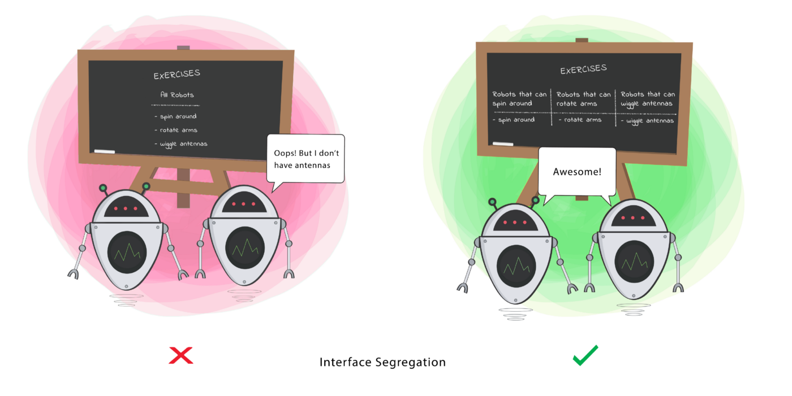

###### created by [osman-boy](https://github.com/osman-boy)
# **ISP - Interface segregation principle**

Принцип разделения(сегрегации) интерфейсов. Клиенты не должны зависеть от методов, которые они не используют. Стремитесь
к тому, чтобы интерфейсы были достаточно узкими, чтобы классам не приходилось реализовывать избыточное поведение.
Принцип разделения интерфейсов говорит о том, что слишком «толстые» интерфейсы необходимо разделять на более маленькие и
специфические, чтобы клиенты маленьких интерфейсов знали только о методах, которые необходимы им в работе. В итоге при
изменении метода интерфейса не должны меняться клиенты, которые этот метод не используют.



_Расмотрим пример нарушения этого принципа_:

```kotlin
interface Bird {
    fun fly()
    fun eat()
    fun swim()
    fun sleep()
}

class Eagle : Bird {

    override fun fly() = println("I'm flying")

    override fun eat() = println("I'm eating")

    // Но орел не умеет плавать, мы были вынуждены реализовать метод интерфейса которого даже не используем.
    override fun swim() = Unit

    override fun sleep() = println("I'm sleeping")

}

class Penguin : Bird {

    // А пингвин не умеет летать, мы были вынуждены реализовать метод интерфейса которого даже не используем.
    override fun fly() = println("I'm flying")

    override fun eat() = println("I'm eating")

    override fun swim() = println("I'm swimming")

    override fun sleep() = println("I'm sleeping")

}
```
Как мы видим, мы наследуем методы которых не можем даже реализовать, и они даже не нужны,
но мы вынуждены их реализовать потому что наш метод слишком толстый.
Решение:
```kotlin
interface Bird {
    fun sleep()
    fun eat()
}

interface Flyable {
    fun fly()
}

interface Swimmable {
    fun swim()
}

//Мы реализовали лишь то что умеет делать Домашняя утка.
class HomemadeDuck : Bird , Swimmable {

    override fun eat() = println("I'm eating")

    override fun swim() = println("I'm swimming")
    
    override fun sleep() = println("I'm sleeping")

}

class Eagle : Bird , Flyable {

    override fun eat() = println("I'm eating")
    
    override fun fly() = println("I'm flying")
    
    override fun sleep() = println("I'm sleeping")
    
}

class Penguin : Bird, Swimmable {
    
    override fun eat() = println("I'm eating")

    override fun swim() = println("I'm swimming")

    override fun sleep() = println("I'm sleeping")

}
```

Путем разделения интерфейсов мы решили проблему, мы создали несколько узко специфических интерфейсов.
И теперь каждая птица будет иметь то поведение которая ей присущая.
