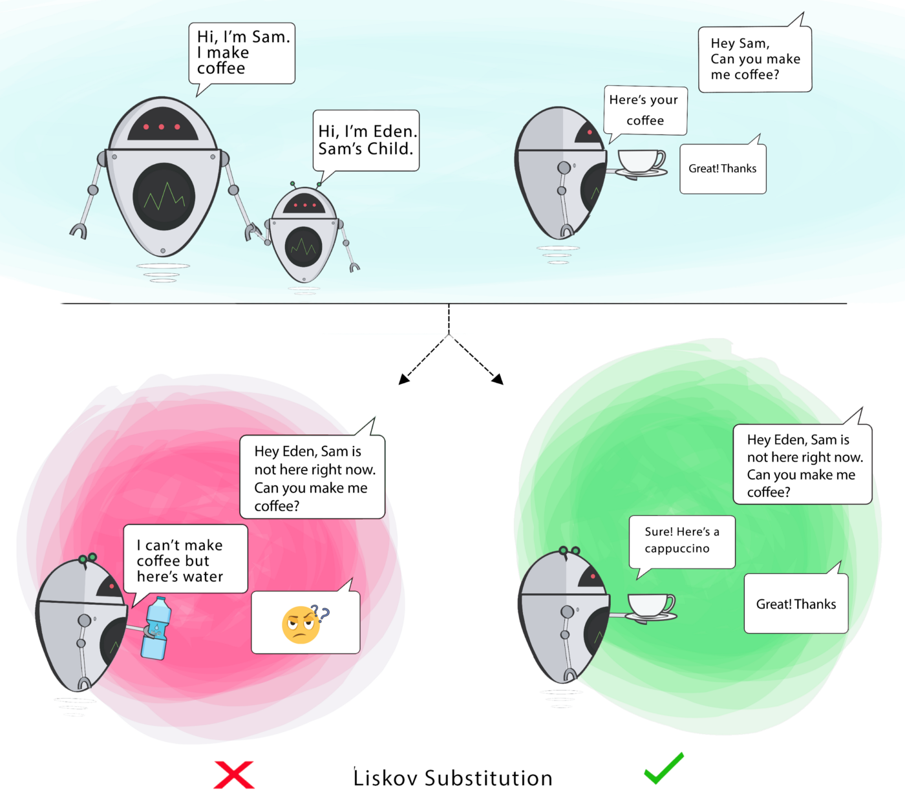

###### created by [osman-boy](https://github.com/osman-boy)

## Принцип замещения Лискова

LSP(Liskov Substitution Principle) - Принцип подстановки Барбары Лисков. Стремитесь создавать подклассы таким образом,
чтобы их объекты можно было бы подставлять вместо объектов базового класса, не ломая при этом функциональности
клиентского кода. Принцип гласит что мы можем заменить родительским класс дочерним классом без изменения работы
программы. Мы должны иметь возможность использовать подклассы вместо родительских классов, без необходимости вносить
какие-либо изменения в наш код. Поскольку дочерние классы расширяются от родительских классов, они наследуют своё
поведение. Если дочерние классы не могут выполнять поведение, принадлежащее родительским классам, вероятно, мы не будем
писать код в методе(заглушка), который выполняет поведение, или мы будем выдавать ошибку(исключение), когда объекты
захотят его использовать. Но эти действия вызывают загрязнение кода и нарушение принципа.



Нарушение принципа LSP:

```kotlin
open class MediaPlayer {
    // Воспроизвести аудио реализацию
    fun playAudio() {
        println("Playing audio...")
    }

    // Воспроизведение видео реализации
    open fun playVideo() {
        println("Playing video...")
    }
}

class VlcAudioMediaPlayer : MediaPlayer()


class DivAudioMediaPlayer : MediaPlayer()


class WinampAudioMediaPlayer : MediaPlayer() {
    // Воспроизведение видео не поддерживается в проигрывателе Winamp.
    override fun playVideo() {
        // иногда даже используется пустая реализация.
        throw VideoUnsupportedException("sorry i can't play video!")
    }

}

class VideoUnsupportedException(message: String) : RuntimeException(message)


fun main() {

    //Этот метод воспроизводит видео во всех плеерах 
    fun playVideoInAllMediaPlayers(players: List<MediaPlayer>) {
        for (player in players)
            player.playVideo()

    }

    // Создан список проигрывателей
    val players = mutableListOf<MediaPlayer>()
    players.add(VlcAudioMediaPlayer())
    players.add(DivAudioMediaPlayer())

    // Воспроизведение видео во всех плеерах
    playVideoInAllMediaPlayers(players)

    // Ну - пока все работает...... :-)
    // Теперь добавляем новый проигрыватель Winamp
    players.add(WinampAudioMediaPlayer())

    /**
     * Снова воспроизвести видео во всех плеерах и Ой, это сломало программу...
     * Почему мы получили неожиданное поведение в клиенте? --- Поскольку LSP нарушается в WinampMediaPlayer.java,
     * поскольку это изменило исходное поведение суперкласса [MediaPlayer]
     */
    playVideoInAllMediaPlayers(players)
}
```

И за-того что дочерний класс не смог сделать то что умеет делать его родитель, работа программы была нарушена. Дочерний
класс не смог оправдать то поведение которую его родитель на него возлогал. Решение проблемы:

```kotlin
open class AudioMediaPlayer {
    // Реализация воспроизведения звука
    fun playAudio() = println("Воспроизведение аудио...")
}


open class VideoAudioMediaPlayer : AudioMediaPlayer() {
    // Реализация воспроизведения видео
    fun playVideo() = println("Воспроизведение видео...")

}

class DivAudioMediaPlayer : VideoAudioMediaPlayer() {
    // Здесь находится код DivMediaPlayer
}

class VlcAudioMediaPlayer : VideoAudioMediaPlayer() {
    // Здесь находится код VlcMediaPlayer
}


class WinampMediaPlayer : AudioMediaPlayer() {
    // Здесь находится код WinampMediaPlayer
}


fun main() {

    // Этот метод воспроизводит видео во всех плеерах
    fun playVideoInAllMediaPlayers(allPlayers: List<VideoAudioMediaPlayer>) {
        for (player in allPlayers)
            player.playVideo()

    }

    // Создан список видеоплееров
    val allPlayers = mutableListOf<VideoAudioMediaPlayer>()
    allPlayers.add(VlcAudioMediaPlayer())
    allPlayers.add(DivAudioMediaPlayer())

    // Воспроизведение видео во всех плеерах
    playVideoInAllMediaPlayers(allPlayers)

    // Ну - пока все работает...... :-)

    /** Теперь добавляем новый проигрыватель Winamp. Если вы раскомментируете строку ниже,
     * это выдаст ошибку времени компиляции, поскольку невозможно добавить аудиоплеер в список видеоплееров.
     */
    //    allPlayers.add(новый WinampMediaPlayer());

}
```

Принцип RSP дополняет также принцип открытости/закрытости. Нарушая принцип RSP мы незамечая
нарушаем и ISP. Потому что классы наследуют те методы которые им не нужны.