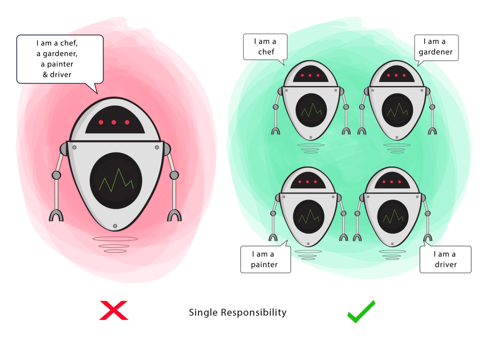

###### created by [osman-boy](https://github.com/osman-boy)
# **SRP**
SRP(Single Responsibility Principle) - Принцип единственной ответственности. Класс должен иметь только одну причину(мотив) для изменения. Стремитесь
к тому, чтобы каждый класс отвечал только за одну часть функциональности программы, причём она должна быть полностью
инкапсулирована в этот класс. Другими словами, если есть необходимость изменить класс по нескольким причинам, то это
противоречит принципу единой ответственности.

«Одно поручение. Всего одно.» — Локи говорит Скурджу в фильме «Тор: Рагнарёк»




Например, давайте посмотрим на класс AuthenticationService ниже, c методами входа и выхода, чтобы пользователь мог
управлять процессом проверки подлинности:

```kotlin
class AuthenticationService {
    fun signIn() {
        //Этот метод будет выполнять операцию входа в аккаунт.
    }

    fun signOut() {
        //Этот метод будет выполнять операцию выхода из аккаунта.
    }
}
```

Теперь предположим, что нам нужно внести некоторые изменения в процесс аутентификации в методах входа и выхода, И так у
нас есть две причины для изменения. Что добавило более одной ответственности к одному классу. Когда такие сценарии
происходят, мы должны разделить наши классы. Чтобы решить эту проблему, мы должны создать две классы для управления
процессом аутентификации, один для входа один для выхода. Решение:

```kotlin
class SignInService {
    fun signIn() {
        //Этот метод будет выполнять операцию входа в аккаунт.
    }

}

class SignOutService {
    fun signOut() {
        //Этот метод будет выполнять операцию выхода из аккаунта.
    }
}
```


