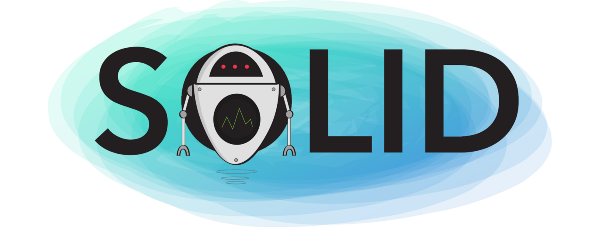

###### created by [osman-boy](https://github.com/osman-boy)

# **SOLID**

**SOLID** — это аббревиатура от первых пяти принципов объектно-ориентированного проектирования (OOD) Роберта С.
Мартина (также известного как дядя Боб) который сделал их более понятными, гибкими и поддерживаемыми.

Что на самом деле означают принципы SOLID? Ну, это просто аббревиатура из пяти принципов, перечисленных ниже:

* S - Единый принцип ответственности (известный как SRP).
* O - Открытый/Закрытый принцип.
* L - Принцип замены Лиськова.
* I - Принцип сегрегации интерфейса.
* D - Принцип инверсии зависимостей.

