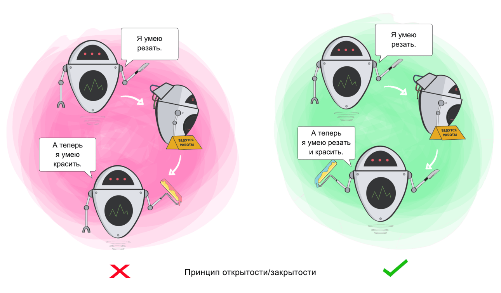

###### created by [osman-boy](https://github.com/osman-boy)

# **OCP - Open closed principle.**

Принцип открытости / закрытости. Программные сущности, такие как классы, функции, модули,
должны быть открыты для расширения, но закрыты для модификаций(изменения существующего, 
хорошо функционирующего). Расширяйте классы, но не изменяйте их первоначальный код.
Стремитесь к тому, чтобы классы были открыты для расширения, но закрыты для изменения.
Главная идея этого принципа в том, чтобы не ломать существующий код при внесении изменений
в программу. Класс можно назвать открытым, если он доступен для расширения.
Но не стоит следовать этому принципу буквально для каждого изменения.
Если вам нужно исправить ошибку в исходном классе, просто возьмите и сделайте это.
Нет смысла решать проблему родителя дочернем классе.



**Принцип «открытый-закрытый»**
Этот принцип имеет два значения:

* Открытый: Это означает, что мы можем добавлять новые функции в наши классы. Когда есть новое требование, 
мы должны иметь возможность легко добавлять новые функции в наш класс.
* Закрывать: Это означает, что базовые характеристики класса не должны быть изменены.


_Давайте посмотрим на следуюущий пример нарушения этого принципа:_
```kotlin
class PDF {
    fun readPdf() {
        //Этот метод будет выполнять операцию чтение PDF формата
    }
}

class Mobi {
    fun readMobi() {
        //Этот метод будет выполнять операцию чтение Mobi формата
    }
}

class Reader {
    
    // Чем больше форматов у нас будет, тем больше блоков if придется добавить.
     
    fun readFile(file: Any) {
        if (file is Mobi) file.readMobi()
        if (file is PDF) file.readPdf()
    }
}
```

Теперь предположим, что мы решили добавить возможность чтения и других форматов в нашу программу, И при каждом добавлений 
нового формата, наш класс чтения будет затронут. Внимательно изучив код, мы видим, что у нас есть оператор if-else для
разделения форматов, и по мере увеличения форматов они будут продолжать расти таким образом, 
потому что класс не закрыт для модификации и не открыт для расширения.
Следовательно, это нарушает наш принцип открытого-закрытого.
Решение:

```kotlin
interface Format {
    fun read()
}

class PDF : Format {
    override fun read() {
        //Этот метод будет выполнять операцию чтение PDF формата
    }
}

class Mobi : Format {
   override fun read() {
        //Этот метод будет выполнять операцию чтение Mobi формата
    }
}

class Reader {
    
    // При добавлений новых форматов в программу, нам не придется изменить уже существующий код, а лишь реализовать интерфейс
    // [Format] и прописать реализацию метода [Format.read] характерную для определенного формата.
     
    private fun read(file: Format) {
        file.read()
    }
}
```
И допустим мы захотели добавить возможность чтения TXT формата, м можем сделать это без проблем и изминений.
Лишь напишем новый код характерный для конкретного формата:
```kotlin
class Txt : Format {
    override fun read() {
        //Этот метод будет выполнять операцию чтение Txt формата
    }
}
```
